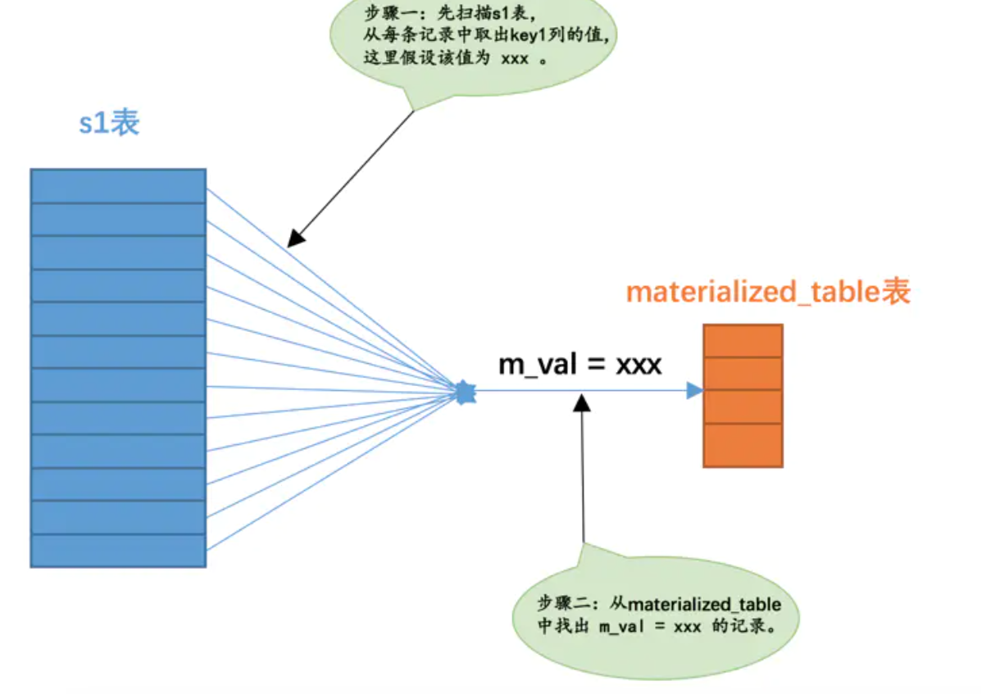

# MySQL 基于规则的优化

一些比较重要的重写规则。

## `条件化简`

### `常量传递（constant_propagation）`

#### `AND :`

*   有时候某个表达式是某个列和某个常量做等值匹配：

        a = 5

*   当这个表达式和其他涉及列a的表达式使用AND连接起来时，可以将其他表达式中的a的值替换为5，比如这样：

        a = 5 AND b > a

*   就可以被转换为：

        a = 5 AND b > 5

但是注意：使用 or 就不能进行这样的转换：

#### `OR :`

*   如当有一条数据为 a = 0, b = 1 :

        a = 5 OR b > a  ≠ a = 5 OR b > 5

#### `不能转化的原因：`

*   因为 OR 为并集，只要其中一个条件满足即可，而 AND 取交集，所以当有数据为 a = 0,b = 1 时：

        a = 5 OR b > a     # 为 a = 5  条件满足 或者 b > a 条件满足

        a = 5 OR b > 5     # 为 a = 5, 条件满足 或者 b > 5 条件满足，而 a 不一定要等于5

        a = 5 AND b > a    # AND 需要两个条件都满足，所以 a 必须要满足等于 5 这个条件
        
        a = 5 AND b > 5    # 所以使用 AND 可以转化成常数

## `派生表：`

设计MySQL的大叔把这种由子查询结果集组成的表称之为 `派生表`，`t` 就是 `派生表` 。

    SELECT m, n FROM (SELECT m2 + 1 AS m, n2 AS n FROM t2 WHERE m2 > 2) AS t;

## `按返回的结果集区分子查询`

### `1、标量子查询`

那些只返回一个单一值的子查询称之为标量子查询，比如这样：

    SELECT (SELECT m1 FROM t1 LIMIT 1);

或者

    SELECT * FROM t1 WHERE m1 = (SELECT MIN(m2) FROM t2);

这两个查询语句中的子查询都返回一个单一的值，也就是一个标量。这些标量子查询可以作为一个单一值或者表达式的一部分出现在查询语句的各个地方。

`注意：`

*   `SELECT` 子句中，我们前边说过的在查询列表中的子查询必须是 `标量子查询`。

        mysql> SELECT (SELECT m1, n1 FROM t1);

        ERROR 1241 (21000): Operand should contain 1 column(s)

*   子查询使用 `=、>、<、>=、<=、<>、!=、<=>` 等操作符和某个操作数组成一个布尔表达式，这样的子查询必须是 `标量子查询` 或者 `行子查询`。

### `2、行子查询`

就是返回一条记录的子查询，不过这条记录需要包含多个列，如：

    SELECT * FROM t1 WHERE (m1, n1) = (SELECT m2, n2 FROM t2 LIMIT 1);

其中的(SELECT m2, n2 FROM t2 LIMIT 1)就是一个行子查询

### `3、列子查询`

列子查询就是查询出一个列的数据，不过这个列的数据需要包含多条记录

    SELECT * FROM t1 WHERE m1 IN (SELECT m2 FROM t2);

### `4、表子查询`

子查询的结果既包含很多条记录，又包含很多个列，如：

    SELECT * FROM t1 WHERE (m1, n1) IN (SELECT m2, n2 FROM t2);

## `相关子查询和不相关子查询`

### `1、不相关子查询`

如果子查询可以单独运行出结果，而不依赖于外层查询的值，我们就可以把这个子查询称之为不相关子查询，如：

    SELECT * FROM s1 
        WHERE key1 IN (SELECT common_field FROM s2);

#### `对于该不相关子查询的执行流程：`

*   先单独执行 `(SELECT common_field FROM s2 WHERE key3 = 'a' LIMIT 1)` 这个子查询。

*   然后在将上一步子查询得到的结果当作外层查询的参数再执行外层查询 `SELECT * FROM s1 WHERE key1 = ...。`

也就是说，`对于包含不相关的标量子查询或者行子查询的查询语句来说，MySQL会分别独立的执行外层查询和子查询，就当作两个单表查询就好了`。

### `2、相关子查询`

如果子查询的执行需要依赖于外层查询的值，我们就可以把这个子查询称之为相关子查询。比如：

    SELECT * FROM t1 WHERE m1 IN (SELECT m2 FROM t2 WHERE n1 = n2);

例子中的子查询是(SELECT m2 FROM t2 WHERE n1 = n2)，可是这个查询中有一个搜索条件是n1 = n2，别忘了n1是表t1的列，也就是外层查询的列，也就是说子查询的执行需要依赖于外层查询的值，所以这个子查询就是一个相关子查询。

#### `对于该相关子查询的执行流程：`

如该例子：

    SELECT * FROM s1 WHERE 
        key1 = (SELECT common_field FROM s2 WHERE s1.key3 = s2.key3 LIMIT 1);

*   先从外层查询中获取一条记录，本例中也就是先从`s1`表中获取一条记录。

*   然后从上一步骤中获取的那条记录中找出子查询中涉及到的值，本例中就是从`s1`表中获取的那条记录中找出`s1.key3`列的值，然后执行子查询。

*   最后根据子查询的查询结果来检测外层查询`WHERE`子句的条件是否成立，如果成立，就把外层查询的那条记录加入到结果集，否则就丢弃。

*   再次执行第一步，获取第二条外层查询中的记录，依次类推～

## `IN子查询优化`

### `1、IN子查询优化`

对于不相关的IN子查询，比如这样:

    SELECT * FROM s1 
        WHERE key1 IN (SELECT common_field FROM s2 WHERE key3 = 'a');

不相关的 `IN子查询` 和不相关的 `标量子查询` 或者 `行子查询` 是不一样的，因为当单独执行子查询后的结果集太多的话，就会导致这些问题：

*   结果集太多，可能内存中都放不下

*   结果集太多，可能内存中都放不下
对于外层查询来说，如果子查询的结果集太多，那就意味着IN子句中的参数特别多，这就导致：

    *   无法有效的使用索引，只能对外层查询进行全表扫描。

    *   在对外层查询执行全表扫描时，由于 `IN子句` 中的参数太多，这会导致检测一条记录是否符合和 `IN子句` 中的参数匹配花费的时间太长,比如这样：

            SELECT * FROM tbl_name WHERE column IN (a, b, c ..., ...);

        那么这样每条记录需要判断一下它的 `column` 列是否符合 `column = a OR column = b OR column = c OR ...` ，这样性能耗费可就多了。

### `2、物化表`

`不直接将不相关子查询的结果集当作外层查询的参数，而是将该结果集写入一个临时表里。`写入临时表的过程是这样的：

*   该临时表的列就是子查询结果集中的列。

*   写入临时表的记录会被去重。

    在将结果集写入临时表时对记录进行去重可以让临时表变得更小，更省地方。

*   一般情况下子查询结果集不会大的离谱，所以会为它建立基于内存的使用Memory存储引擎的临时表，而且会为该表建立哈希索引。

    建立hash索引后，查询的速度会大大增加，因为 in 只用来判断某个操作数在不在集合中。

    如果子查询的结果集非常大，超过了系统变量tmp_table_size或者max_heap_table_size，临时表会转而使用基于磁盘的存储引擎来保存结果集中的记录，索引类型也对应转变为B+树索引。

将子查询结果集中的记录保存到临时表的过程称之为 `物化（英文名：Materialize）`,为了方便起见，我们就把那个存储子查询结果集的临时表称之为 `物化表` 。正因为物化表中的记录都建立了索引（基于内存的物化表有哈希索引，基于磁盘的有B+树索引），通过索引执行 `IN语句` 判断某个操作数在不在子查询结果集中变得非常快，从而提升了子查询语句的性能。

### `3、物化表转连接`

    SELECT * FROM s1 
        WHERE key1 IN (SELECT common_field FROM s2 WHERE key3 = 'a');

当我们把子查询进行物化之后，假设子查询物化表的名称为 `materialized_table`，该物化表存储的子查询结果集的列为 `m_val`，那么这个查询其实可以从下边角度来看待：

*   从表 `s1` 的角度来看待，整个查询的意思其实是：对于 `s1` 表中的每条记录来说，如果该记录的 `key1` 列的值在子查询对应的物化表中，则该记录会被加入最终的结果集。

*   从表 `s2` 的角度来看待，整个查询的意思其实是：对于子查询物化表的每个值来说，如果能在s1表中找到对应的key1列的值与该值相等的记录，那么就把这些记录加入到最终的结果集 (和上面对比箭头相反)。

*   相当于表s1和子查询物化表materialized_table进行内连接：

        SELECT s1.* FROM s1 INNER JOIN materialized_table ON key1 = m_val;

    `转化成内连接之后，查询优化器可以评估不同连接顺序需要的成本是多少，选取成本最低的那种查询方式执行查询。`

*   接下来就可以评估分别将 `s1表` 作为驱动表或者 `materialized_table表` 作为驱动表分别 `评估查询消耗的成本` ，来决定哪一个作为驱动表。

值得注意的是：mysql 不会在一开始就创建物化表，也就是在查询中真正使用到派生表时才回去尝试物化派生表，而不是还没开始执行查询呢就把派生表物化掉。比方说对于下边这个含有派生表的查询来说：

    SELECT * FROM (
        SELECT * FROM s1 WHERE key1 = 'a'
                ) AS derived_s1 INNER JOIN s2
                ON derived_s1.key1 = s2.key1
                WHERE s2.key2 = 1;

如果采用物化派生表的方式来执行这个查询的话，那么执行时首先会到 `s2` 表中找出满足 `s2.key2 = 1` 的记录，如果压根儿找不到，说明参与连接的 `s2` 表记录就是空的，所以整个查询的结果集就是空的，所以也就没有必要去物化查询中的派生表了。

## `将子查询转换为semi-join`

虽然建立 物化表 可以帮助我们优化 IN ，但是建立 物化表 还是会消耗资源，那么有没有更高效的方法来优化呢？也就是：`能不能不进行物化操作直接把子查询转换为连接呢？`

### `1、半连接`

将s1表和s2表进行半连接的意思就是：对于s1表的某条记录来说，我们只关心在s2表中是否存在与之匹配的记录，而不关心具体有多少条记录与之匹配，最终的结果集中只保留s1表的记录。

如何使用 `半连接` ？有以下方法：

#### `1、Table pullout （子查询中的表上拉）`

当子查询的查询列表处只有主键或者唯一索引列时，可以直接把子查询中的表上拉到外层查询的FROM子句中，并把子查询中的搜索条件合并到外层查询的搜索条件中，比如这个:

    SELECT * FROM s1 
    WHERE key2 IN (SELECT key2 FROM s2 WHERE key3 = 'a');

由于key2列是s2表的唯一二级索引列，所以我们可以直接把s2表上拉到外层查询的FROM子句中，并且把子查询中的搜索条件合并到外层查询的搜索条件中，上拉之后的查询就是这样的：

    SELECT s1.* FROM s1 INNER JOIN s2 
        ON s1.key2 = s2.key2 
        WHERE s2.key3 = 'a';

#### `2、DuplicateWeedout （重复值消除）`

使用临时表对 `semi-join` 产生的结果集去重。

#### `3、LooseScan（松散扫描）`

把 `inner-table` 数据基于索引进行分组，取每组第一条数据进行匹配，如在 `s2` 表的`idx_key1` 索引中，值为 `'aa'` 的二级索引记录一共有 `3` 条，那么只需要取第一条的值到 `s1` 表中查找 `s1.key3 = 'aa'` 的记录，如果能在 `s1` 表中找到对应的记录，那么就把对应的记录加入到结果集。依此类推，其他值相同的二级索引记录，也只需要取第一条记录的值到 `s1` 表中找匹配的记录，这种虽然是扫描索引，但只取值相同的记录的第一条去做匹配操作的方式称之为 `松散扫描`。

#### `4、Materialization`

我们之前介绍的先把外层查询的 `IN` 子句中的不相关子查询进行物化，然后再进行外层查询的表和物化表的连接本质上也算是一种 `semi-join` ，只不过由于物化表中没有重复的记录，所以可以直接将子查询转为连接查询。

#### `5、FirstMatch（首次匹配）`

只选用内部表的第1条与外表匹配的记录,执行流程和 `相关子查询` 的执行方式是一样的，就是说先取一条外层查询的中的记录，然后到子查询的表中寻找符合匹配条件的记录，如果能找到一条，则将该外层查询的记录放入最终的结果集并且停止查找更多匹配的记录，如果找不到则把该外层查询的记录丢弃掉；然后再开始取下一条外层查询中的记录，重复上边这个过程。

#### `需要大家注意的是，由于相关子查询并不是一个独立的查询，所以不能转换为物化表来执行查询。`

### `2、半连接 的适用条件`

并不是所有包含IN子查询的查询语句都可以转换为semi-join，只有形如这样的查询才可以被转换为semi-join：

    SELECT ... FROM outer_tables 
        WHERE expr IN (SELECT ... FROM inner_tables ...) AND ...

或者这样的形式也可以：

    SELECT ... FROM outer_tables 
        WHERE (oe1, oe2, ...) IN (SELECT ie1, ie2, ... FROM inner_tables ...) AND ...

用文字总结一下，只有符合下边这些条件的子查询才可以被转换为semi-join：

*   1、该子查询必须是和 `IN` 语句组成的布尔表达式，并且在外层查询的 `WHERE` 或者 `ON` 子句中出现。
    
    `出现如下，则不适用：` 使用 `NOT IN` 而不是 `IN` 的情况

        SELECT * FROM s1 
        WHERE key1 NOT IN (SELECT common_field FROM s2 WHERE key3 = 'a')

    `出现如下，则不适用：`在 `SELECT` 子句中的 `IN` 子查询的情况

        SELECT key1 IN (SELECT common_field FROM s2 WHERE key3 = 'a') FROM s1 ;

*   2、外层查询也可以有其他的搜索条件，只不过和IN子查询的搜索条件必须使用 `AND` 连接起来。

    `出现如下，则不适用：`外层查询的WHERE条件中有其他搜索条件与IN子查询组成的布尔表达式使用 `OR` 连接起来。

        SELECT * FROM s1 
        WHERE key1 IN (SELECT common_field FROM s2 WHERE key3 = 'a')
            OR key2 > 100;

*   3、该子查询必须是一个单一的查询，不能是由若干查询由 `UNION` 连接起来的形式。

    `出现如下，则不适用：` 子查询中包含 `UNION` 的情况

        SELECT * FROM s1 WHERE key1 IN (
            SELECT common_field FROM s2 WHERE key3 = 'a' 
            UNION
            SELECT common_field FROM s2 WHERE key3 = 'b'
        );

*   4、该子查询不能包含 `GROUP BY` 或者 `HAVING` 语句或者 `聚集函数`。

    `出现如下，则不适用：` 子查询中包含 `GROUP BY、HAVING` 或者 `聚集函数` 的情况
    
        SELECT * FROM s1 
            WHERE key2 IN (SELECT COUNT(*) FROM s2 GROUP BY key1);

*   5、... 还有一些条件比较少见

`MySQL` 仍然留了两手绝活来优化不能转为 `semi-join` 查询的子查询，那就是：

*   对于不相关子查询来说，可以尝试把它们物化之后再参与查询

    比如我们上边提到的这个查询：

        SELECT * FROM s1 
            WHERE key1 NOT IN (SELECT common_field FROM s2 WHERE key3 = 'a')

    先将子查询物化，然后再判断 `key1` 是否在物化表的结果集中可以加快查询执行的速度。

*   不管子查询是相关的还是不相关的，都可以把 `IN` 子查询尝试转为 `EXISTS` 子查询

    为什么要转换呢？这是因为不转换的话可能用不到索引

需要注意的是，如果 `IN` 子查询不满足转换为 `semi-join` 的条件，又不能转换为物化表或者转换为物化表的成本太大，那么它就会被转换为 `EXISTS` 查询。

#### ==== 笔记摘录总结于：MySQL 是怎样运行的：从根儿上理解 MySQL ====

