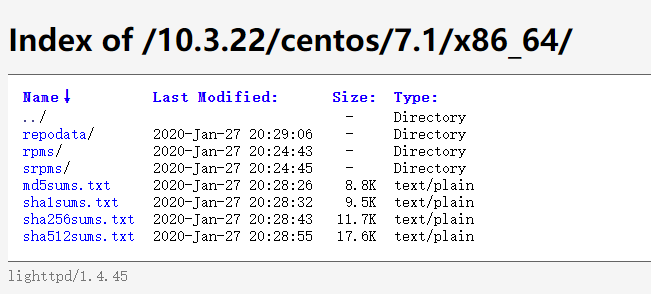

# MariaDB 版本升级

## MariaDB 与Mysql版本对应关系

*   MariaDB 5.5 对应 Mysql 5.5

*   5.5以下的版本都是上述对应关系

*   MariaDB 10.0 对应 Mysql 5.6

*   MariaDB 10.1 对应 Mysql 5.7

## 备份原有数据

    # 备份数据库，如果升级顺利是不要实施备份还原的
    mysqldump -u root -p --all-databases > alldb.sql
    # 如果想保留自己的my.cof配置，则备份一下这个文件
    cp /etc/my.cnf /etc/my.cnf.bak
    # 停止数据库运行
    systemctl stop mariadb
    # 卸载MariaDB老版本
    yum remove mariadb mariadb-server

## 添加新的 mariadb yum 源

### 确定系统发行版本号和cpu架构

    # 确定发行版本
    cat /proc/version

    # 查看cpuinfo
    cat /proc/cpuinfo

### 添加 yum 源

http://yum.mariadb.org/

    # 添加MariaDB官方源
    vi /etc/yum.repos.d/MariaDB.repo

    # MariaDB 10.3 CentOS repository list
    # http://downloads.mariadb.org/mariadb/repositories/
    [mariadb]
    name = MariaDB
    baseurl = http://yum.mariadb.org/10.3.22/centos/7.1/x86_64/
    gpgkey=https://yum.mariadb.org/RPM-GPG-KEY-MariaDB
    gpgcheck=1

    # 清除yum缓存
    yum clean all 
    yum makecache

### 安装 新版 mariadb

    # 安装MariaDB新版本
    yum install mariadb mariadb-server

    # 启动新版MariaDB
    systemctl start mariadb

    # 升级已有数据库
    mysql_upgrade -uroot -p 